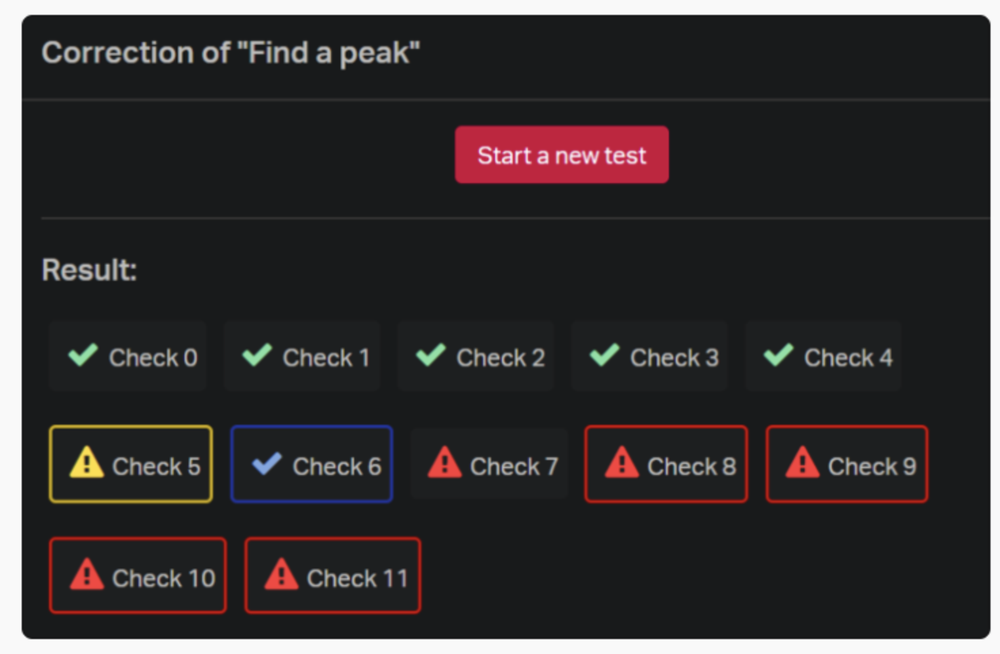

# **checksOnChecks**
**HackDay 04-10-2019**

Our product is a "Requirement Checker". With this checker, you will be able to push your files
to Github and run the original checker. This is where our checker comes in, it checks to make 
sure you have some of the requriements you need including:

     * README exists, is not empty and or is empty
     * File is executable
     * If file has a new line

# **The Project**

  	By team of ~8, you are free to build what you want, it just needs to be related to Holberton and the Checker.
	You can build a web app, a desktop app, a game, a webhook, a SDK, a Git hook, etc. 
	The only limit is your creativity (and our API limits!) You can also integrate other API like Github or Twitter for example.

# **Organization**

        You will work by team of ~8, it’s important to stay organized! We are strongly recommending you to nominate a product manager to follow each part of your project:

	John Cook - "Product Manager - Owner of Repository"
	Amber McBride - "Operations Manager - Makes sure everyhing is running efficiently and effectively"
	Sofía Cheung -  "Asst. Development Manager - Developing - Methods, New Line, Executable, etc"
	Kenneth Mensah -  "Development Manager - Developing - New Line, Executable, etc"
	**Grayson Stiegler**
 -  "Marketing and Branding Manager - Project name, README, AUTHORS, Documentation"

# **Installation and Usage**

  	1. Please install `gitpython`
	2. Use `sudo pip3 install gitpython`
	3. See https://gitpython.readthedocs.io/en/stable/intro.html for more details
	4. Import the package `checksOnChecks`
	5. Run the `main.py` file in the command line

# **Authors**

John Cook - Email [john.cook@holbertonschool.com] / Github [https://github.com/JohnCook17] / Twitter [https://twitter.com/celox_umbra]

Amber McBride - Email [amber.mcbride@holbertonschool.com] / Github [https://github.com/abmcbride5] / Twitter [https://twitter.com/Ambie_Mick]

Sofía Cheung - Email [sofia.cheung@holbertonschool.com] / Github [https://github.com/Svcg17] / Twitter [https://twitter.com/sofivism]

Kenneth Mensah - Email [kenneth.mensah@holbertonschool.com] / Github [https://github.com/Ken-Mens] / Twitter [https://twitter.com/Kmens5]

Grayson Stiegler - Email [682@holbertonschool.com] / Github [https://github.com/gstieg] / Twitter [https://twitter.com/gstieg0809]
